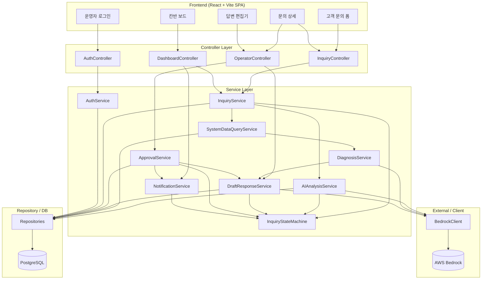
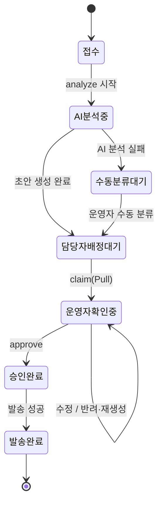

# 컴포넌트 의존성 (Component Dependency)

> 컴포넌트 간 의존성 매트릭스, 통신 패턴, 데이터 흐름을 정의한다.

---

## 1. 전체 아키텍처 (계층 다이어그램)



---

## 2. 의존성 매트릭스

행(호출자) → 열(피호출자). ●=직접 의존.

| 호출자 \ 피호출자 | IS | AAS | SDQ | DS | DRS | AS | SM | NS | AUTH | BC | REPO |
|---|---|---|---|---|---|---|---|---|---|---|---|
| InquiryController | ● | | | | | | | | | | |
| OperatorController | | | | | ● | ● | | | | | |
| DashboardController | ● | | | | | | | ● | | | |
| AuthController | | | | | | | | | ● | | |
| InquiryService (IS) | | ● | ● | | | | ● | | | | ● |
| AIAnalysisService (AAS) | | | | | | | ● | | | ● | ● |
| SystemDataQueryService (SDQ) | | | | ● | | | | | | | ● |
| DiagnosisService (DS) | | | | | ● | | | | | ● | |
| DraftResponseService (DRS) | | | | | | | ● | | | ● | ● |
| ApprovalService (AS) | | | | | ● | | ● | ● | | | ● |
| NotificationService (NS) | | | | | | | ● | | | | ● |
| InquiryStateMachine (SM) | | | | | | | | | | | ● |
| AuthService (AUTH) | | | | | | | | | | | ● |
| BedrockClient (BC) | | | | | | | | | | | |

> SDQ→DS, DS→DRS의 연쇄는 파이프라인상 InquiryService 오케스트레이션으로 조정될 수도 있으나(중앙집중형), MVP에서는 단계 결과 전달을 InquiryService가 매개하는 것을 기본으로 한다. 위 매트릭스는 데이터 흐름상 인접 단계 관계를 함께 표기한 것이다.

---

## 3. 통신 패턴

| 경계 | 프로토콜/방식 | 비고 |
|---|---|---|
| Frontend ↔ Controller | HTTP/JSON (REST) | JWT Bearer 토큰(접수 API 제외) |
| Controller ↔ Service | 동기 메서드 호출 (in-process) | 모놀리식 |
| Service ↔ Service | 동기 메서드 호출 | 파이프라인은 비동기 트리거(@Async) |
| Service ↔ Repository | JPA (동기) | 트랜잭션 단계별 분리 |
| BedrockClient ↔ Bedrock | HTTPS (AWS SDK) | 타임아웃 120초, 재시도 정책 적용 |
| Pipeline 트리거 | 비동기 (@Async / 작업 큐) | 접수 응답 즉시 반환 후 백그라운드 처리 |

인증 흐름:
```
Request → [JWT Filter] → AuthService.verifyToken() → Controller → Service
                     └─ 실패 시 401 반환(EDITOR/BOARD/DETAIL은 로그인 리다이렉트)
```

---

## 4. 핵심 데이터 흐름

### 4.1 문의 접수 → 답변 초안 (파이프라인)

```
[고객]                                                         [AWS Bedrock]   [PostgreSQL]
   │ 1.POST /inquiries                                              │              │
   ▼                                                                │              │
InquiryController ──> InquiryService.createInquiry() ───────────────┼──save────────▶ Inquiry(접수)
   │ 2.문의ID 즉시 반환                                              │              │
   │                                                                │              │
   └─(async) triggerAnalysisPipeline()                              │              │
            │                                                       │              │
            ▼                                                       │              │
   AIAnalysisService.analyze() ──prompt──────────────────────────▶ │              │
            │  ◀──분류결과(ai_type,긴급도,요약)──────────────────── │              │
            │  상태: 접수→AI분석중                ──save────────────────────────────▶ AIAnalysis
            ▼                                                       │              │
   SystemDataQueryService.query(ai_type)                            │              │
            │  PaymentQueryStrategy ──select────────────────────────────────────────▶ Payment/ItemDelivery
            │  ◀── SystemQueryResult ───────────────────────────────────────────────
            ▼                                                       │              │
   DiagnosisService.diagnose() ──prompt(조회결과)─────────────────▶ │              │
            │  ◀──원인/처리방향/신뢰도────────────────────────────  │              │
            ▼                                                       │              │
   DraftResponseService.generate() ──prompt(진단)────────────────▶ │              │
            │  ◀──답변초안──────────────────────────────────────── │              │
            │  상태: AI분석중→담당자배정대기      ──save────────────────────────────▶ DraftResponse
            ▼
        [담당자배정대기 — 운영자 Pull 대기]
```

### 4.2 운영자 처리 → 발송

```
[운영자]                                                                 [PostgreSQL]
   │ claim()        OperatorController→ApprovalService                       │
   ▼                상태: 담당자배정대기→운영자확인중 (낙관적 락)  ──update──▶ Inquiry
   │
   ├ 수정  → DraftResponseService.update() ──────────────────────save──────▶ DraftResponse(+이력)
   │
   ├ 반려  → ApprovalService.reject(reason)
   │           └→ DraftResponseService.regenerate(reason) ──Bedrock──▶ 새 초안(+이력)
   │           (운영자확인중 유지)
   │
   └ 승인  → ApprovalService.approve()
               상태: 운영자확인중→승인완료 ──────────────────────update──▶ Inquiry
               └→ NotificationService.sendApprovedResponse()
                     상태: 승인완료→발송완료 (실패 시 재시도)  ──update──▶ Inquiry
```

---

## 5. 상태 머신 (의존 컴포넌트: 전체 Service)



---

## 6. 의존성 설계 원칙

1. **단방향 의존**: Controller → Service → Repository. 역방향 호출 금지.
2. **인터페이스 의존**: `LlmClient`(BedrockClient), `QueryStrategy`(PaymentQueryStrategy 등)는 추상 타입에 의존 → 구현 교체/확장 용이(DIP).
3. **상태 전이 단일화**: 모든 Service는 status를 직접 변경하지 않고 `InquiryStateMachine` 경유.
4. **외부 연동 캡슐화**: AWS Bedrock 접근은 `BedrockClient` 단일 통로로 제한 → 모델 교체·로깅·재시도 정책 일원화.
5. **순환 의존 회피**: 파이프라인 단계 간 직접 상호 호출 대신 InquiryService 오케스트레이션으로 흐름 제어(단, 인접 단계 데이터 전달은 단순 위임 허용).

---

## 7. 프론트엔드 의존 관계

```
AuthContext ──(token)──> ApiClient ──(인터셉터)──> 모든 페이지 컴포넌트
   │
   ├─ LoginPage          → AuthController
   ├─ InquiryFormPage    → InquiryController (공개)
   ├─ KanbanBoardPage    → DashboardController
   ├─ InquiryDetailPage  → InquiryController + OperatorController
   └─ DraftEditor(내장)   → OperatorController
```
