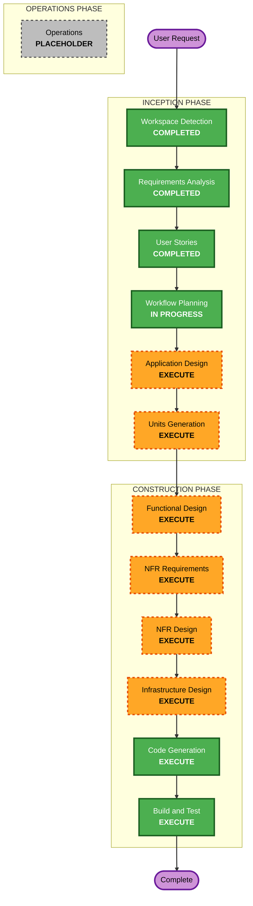

# Execution Plan

## Detailed Analysis Summary

### Change Impact Assessment
- **User-facing changes**: Yes — 고객 문의 폼, 운영자 칸반 대시보드
- **Structural changes**: Yes — 신규 시스템 전체 아키텍처 설계 (Greenfield)
- **Data model changes**: Yes — Inquiry, AIAnalysis, DraftResponse, Operator 등 신규 스키마
- **API changes**: Yes — 신규 REST API 전체
- **NFR impact**: Yes — AI 응답 성능(600초), 인증/보안, 확장성(플러그인 구조)

### Risk Assessment
- **Risk Level**: Medium
- **Rollback Complexity**: Easy (신규 프로젝트, 로컬 데모 환경)
- **Testing Complexity**: Moderate (AI 통합, 상태 머신, 다중 컴포넌트)

## Workflow Visualization

## Phases to Execute

### 🔵 INCEPTION PHASE
- [x] Workspace Detection (COMPLETED)
- [x] Requirements Analysis (COMPLETED)
- [x] User Stories (COMPLETED)
- [x] Workflow Planning (IN PROGRESS)
- [ ] Application Design - **EXECUTE**
  - **Rationale**: Greenfield 신규 시스템으로 컴포넌트/서비스 구조, AI 파이프라인 추상화, 플러그인 확장 구조 설계 필요
- [ ] Units Generation - **EXECUTE**
  - **Rationale**: 백엔드(Spring Boot), 프론트엔드(React), AI 분석 파이프라인 등 여러 작업 단위로 분해 필요

### 🟢 CONSTRUCTION PHASE
- [ ] Functional Design - **EXECUTE**
  - **Rationale**: 데이터 모델(Inquiry, AIAnalysis 등), 상태 머신, 핵심 비즈니스 로직 상세 설계 필요
- [ ] NFR Requirements - **EXECUTE**
  - **Rationale**: AI 응답 성능, 인증/보안, 확장성 요구사항 존재
- [ ] NFR Design - **EXECUTE**
  - **Rationale**: NFR 요구사항을 충족하는 설계 패턴 적용 필요
- [ ] Infrastructure Design - **EXECUTE**
  - **Rationale**: Docker Compose 기반 로컬 배포, PostgreSQL, AWS Bedrock 연동 구성 필요
- [ ] Code Generation - **EXECUTE** (ALWAYS)
  - **Rationale**: 실제 코드 생성
- [ ] Build and Test - **EXECUTE** (ALWAYS)
  - **Rationale**: 빌드, 테스트, 검증

### 🟡 OPERATIONS PHASE
- [ ] Operations - PLACEHOLDER

## Success Criteria
- **Primary Goal**: AI 기반 CS 문의 처리 에이전트 MVP (결제 유형 end-to-end + 확장 가능한 공통 프레임워크)
- **Key Deliverables**:
  - Spring Boot 백엔드 (REST API, AI 파이프라인, 상태 머신, 인증)
  - React 프론트엔드 (고객 문의 폼, 운영자 칸반 대시보드)
  - PostgreSQL 스키마 + 데모 더미 데이터
  - Docker Compose 로컬 배포 구성
  - 단위/통합 테스트
- **Quality Gates**:
  - 핵심 비즈니스 로직 테스트 커버리지 80% 이상
  - 결제 유형 end-to-end 시나리오 동작
  - 운영자 승인 워크플로우(Human-in-the-loop) 검증

## Estimated Timeline
- **Total Phases**: 6 stages to execute (Application Design → Build and Test)
- **Units**: 추정 3~4개 작업 단위 (Units Generation에서 확정)
